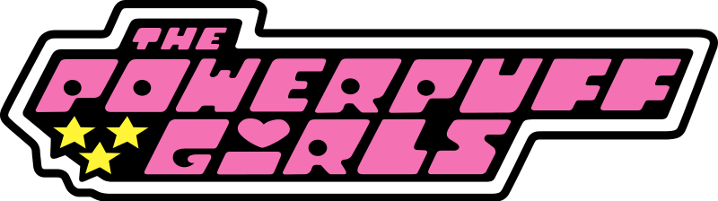
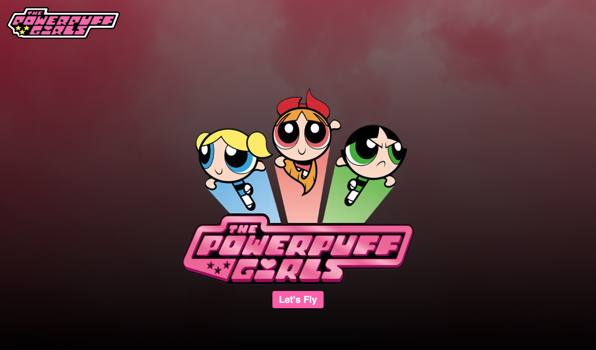
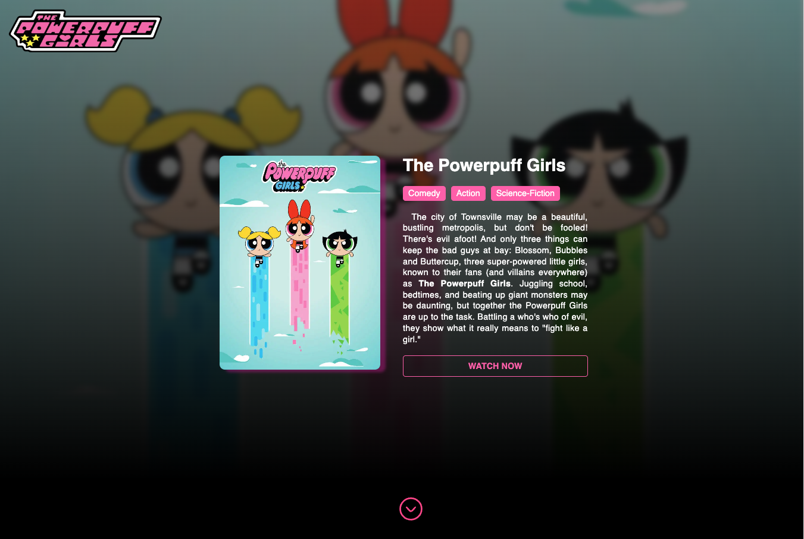
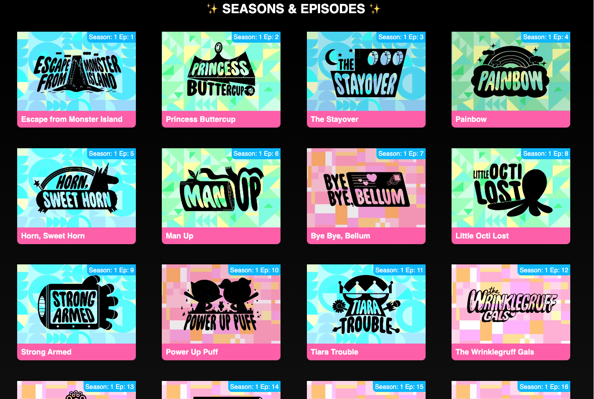

<a id="readme-top"></a>

<br />
<div align="center">
    

  <h3 align="center">✨Powerpuff Girls✨</h3>

  <p align="center">
	Tech assignment for the role of Frontend Developer at RTL
  </p>
</div>

<hr/>

<!-- TABLE OF CONTENTS -->
<details>
  <summary>Table of Contents</summary>
  <ol>
    <li>
      <a href="#about-the-project">About The Project</a>
      <ul>
        <li><a href="#built-with">Built With</a></li>
      </ul>
    </li>
    <li>
      <a href="#getting-started">Getting Started</a>
      <ul>
        <li><a href="#prerequisites">Prerequisites</a></li>
        <li><a href="#installation">Installation</a></li>
      </ul>
    </li>
    <li><a href="#usage">Usage</a></li>
    <li><a href="#license">License</a></li>
    <li><a href="#contact">Contact</a></li>
    <li><a href="#acknowledgments">Acknowledgments</a></li>
  </ol>
</details>

<!-- ABOUT THE PROJECT -->

## About The Project 🚀



This is web application about The Powerpuff Girls. The app is built using NextJs and uses the TVMaze API to fetch the data. The app has the following features:

- Modern UI with a responsive design
- Display all the episodes of the Powerpuff Girls.
- Get details of each episode by clicking on the episode card.
- Search for episodes by name.

<p align="right">(<a href="#readme-top">back to top</a>)</p>

### Built With 🛠 ️

- NextJs
- Sass
- Axios
- Jest & React Testing Library

<p align="right">(<a href="#readme-top">back to top</a>)</p>

<!-- GETTING STARTED -->

## Getting Started

### Prerequisites

You need to have the following installed on your machine:

- node

  ```sh
  node --version
  ```

- npm
  ```sh
  npm install npm@latest -g
  ```

### Installation

This app is built using NextJs, so you need to have NodeJs installed on your machine. Here's how you can get started:

1. Clone the repo
   ```sh
   https://github.com/Tenzijn/powerPuffGirls.git
   ```
2. Install NPM packages
   ```sh
   npm install
   ```
3. Run the app
   ```sh
    npm run dev
   ```

<p align="right">(<a href="#readme-top">back to top</a>)</p>

<!-- LICENSE -->

## License

Distributed under the MIT License. You can use this without any restrictions.

<p align="right">(<a href="#readme-top">back to top</a>)</p>

<!-- CONTACT -->

## Contact

Tenzin Kunchok - tenzin@tibet.dev

<p align="right">(<a href="#readme-top">back to top</a>)</p>

<!-- ACKNOWLEDGMENTS -->

## More Images





## Acknowledgments

- [API - tvmaze.com](https://api.tvmaze.com)

<p align="right">(<a href="#readme-top">back to top</a>)</p>
